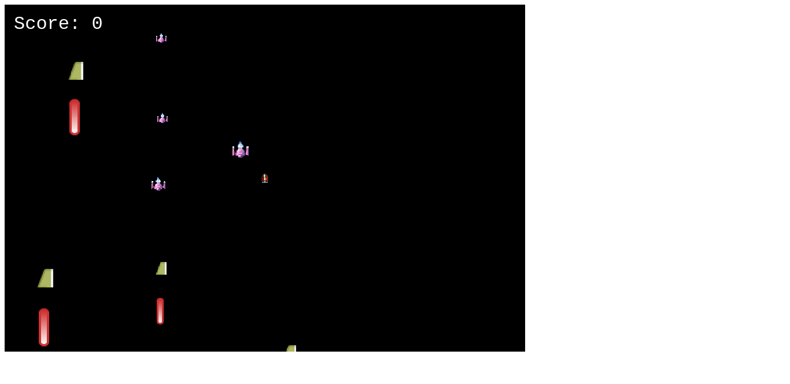

# SpaceShooter game

## Project description
This project is an implementation of an HTML5 game that runs in the browser, using Phaser3 technology. Being new to Phaser,  and game development, I built a very easy-to-play game I used to see my friends playing it a few years ago unfortunately I was not interested in games at that time. But this time I enjoyed working on this project and now I can understand how they felt while playing such a game.

This project is my capstone project at the end of the Microverse Javascript curriculum. The project's specifications are listed [here](https://www.notion.so/Shooter-game-203e819041c7486bb36f9e65faecba27).

## Screenshot

## Built with
- HTML5
- [Phaser 3](https://phaser.io/phaser3)
- Vanilla Javascript

## Features
- Player can enter his/her name
- The player can 
    - move upward, downward, left, and right to avoid enemies.
    - shooter his/her enemies
    - die and the game over scene appears when he is shot or collide with his enemy
- Player's score is increased whenever he/she shoots an enemy
- A player can enable/disable the background music from game settings
- A player can enable/disable the sound from game settings
## Live demo link
:point_right: [Play SpaceShooter on netlify](https://descholar-shooter-game.netlify.app/)

## Running and testing it locally

### Prerequisites
- [NodeJS](https://nodejs.org/)
- [Yarn](https://yarnpkg.com/) or just the default npm which comes with [NodeJS](https://nodejs.org/en/)

### Setup
- Run `git clone https://github.com/descholar-ceo/shooter-game && cd shooter-game` to get a copy of source codes on your local computer and to navigate inside the project directory
- Run `yarn` to install all needed dependencies

### Usage
- Run `yarn dev` to run this app in development environment
- Run `yarn build` for build production ready project

### Tests
- Run `yarn test`

### Instructions for the game
    - Use Upper arrow key from your keyboard to move upward
    - Use Down arrow key from your keyboard to move downward
    - Use Right arrow key from your keyboard to right up
    - Use Down arrow key from your keyboard to move down
    - Use Space  key from your keyboard to Shoot
    - The player must avoid meeting any enemies and being shot in order to stay alive.

## Contributions

There are two ways of contributing to this project:

1.  If you see something wrong or not working, please check [the issue tracker section](https://github.com/descholar-ceo/shooter-game/issues), if that problem you met is not in already opened issues then open a new issue by clicking on `new issue` button.

2.  If you have a solution to that, and you are willing to work on it, follow the below steps to contribute:
    1.  Fork this repository
    1.  Clone it on your local computer by running `git clone https://github.com/your-username/shooter-game.git` __Replace *your username* with the username you use on github__
    1.  Open the cloned repository which appears as a folder on your local computer with your favorite code editor
    1.  Create a separate branch off the *master branch*,
    1.  Write your codes which fix the issue you found
    1.  Commit and push the branch you created
    1.  Raise a pull request, comparing your new created branch with our original master branch [here](https://github.com/descholar-ceo/shooter-game)

## Author

👤 **Mugirase Emmanuel**

- Github: [@descholar-ceo](https://github.com/descholar-ceo)
- Twitter: [@descholar3](https://twitter.com/descholar3)
- Linkedin: [MUGIRASE Emmanuel](https://www.linkedin.com/in/mugirase-emmanuel)

## Show your support

Give a ⭐️ if you like this project!

## Acknowledgment
- [Microverse](https://www.microvese.org)
- [Webpack](https://webpack.js.org/)
- [Phaser3](https://phaser.io/phaser3)
- [OpenGameArt](https://opengameart.org/)